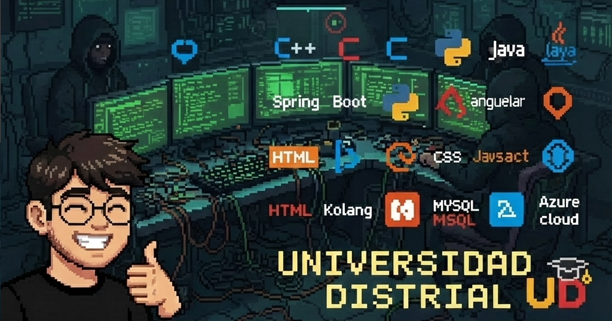

<!-- ===================== HERO ===================== -->
<h1 align="center">Hello! I'm an Open Source & Full-Stack Developer 👨‍💻</h1>

  

<h4 align="center">
  <b>Cloud</b> •
  <b>Full-Stack</b> •
  <b>DevOps</b> •
  <b>Open Source</b>
</h4>

## <picture></picture> About me

<picture> </picture>

  
- :mortar_board: I am a `10th semester student` (completing my degree) at [Faculty of Engineering](https://www.udistrital.edu.co) of [Universidad Francisco José de Caldas](https://www.udistrital.edu.co), in Bogotá, Colombia.
- :technologist: I love using Software as a solution for every `Problem`.
- :computer: I work with `C`, `C++`, `Python`, `Java`, `PHP`, `Spring Boot`, `Django`, `Laravel`, `React`, `PostgreSQL`, `MongoDB`, `OracleDB`, `Azure`, `Supabase`, `Docker`, `Design Patterns`, `Deep Learning`, and more.
- :student: I’m currently learning `Software Architecture` and `Cloud Computing`.
- :nerd_face: Always `learning new things`.
- :thinking: I’m currently open for a new `job opportunity`.
- :globe_with_meridians: [LinkedIn](https://www.linkedin.com/in/daniel-felipe-gomez-miranda-29348625a/)
- :rocket: My website: https://xlufero99.github.io/portafolio/
 

## 👨🏻‍💻 Technologies That I Use Daily

  

---

## 📊 Open Source & GitHub Activity

 

## 🌍 Open-Source Mindset

Inspired by platforms like **OSSInsight**, I value:
- 📈 Data-driven development
- 🤝 Community collaboration
- 🧠 Learning from real GitHub trends
- ⚙️ Measuring impact, not just code

---

## 🤝 Connect With Me

---

